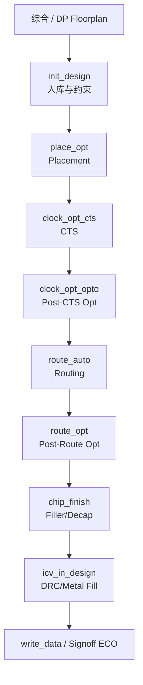

# ICC2 Flat P&R 参考流程框架（rm_icc2_pnr_scripts）

> Synopsys IC Compiler II Flat Place and Route Reference Methodology  
> 版本：T-2022.03  
> 入口：`make -f rm_setup/Makefile_pnr all`

本文梳理 `rm_icc2_pnr_scripts` 在物理设计（PnR）中的阶段顺序、脚本职责、Block 传递关系与配套配置。

---

## 1. 总体定位


| 项目   | 说明                                                                                      |
| ---- | --------------------------------------------------------------------------------------- |
| 工具   | `icc2_shell`（主流程）；可选 `fm_shell`、`vc_static_shell`                                       |
| 输入   | 综合后网表 / DC-ASCII / ICC2-DP 的 NDM                                                        |
| 输出   | 完成布局布线、芯片收尾与 In-Design 签核的 NDM Block，以及 Verilog/DEF/GDS/SPEF 等交付物                       |
| 配置中心 | `rm_setup/design_setup.tcl`、`rm_setup/icc2_pnr_setup.tcl`、`rm_setup/sidefile_setup.tcl` |
| 调度入口 | `rm_setup/Makefile_pnr`                                                                 |


每个实施脚本的通用骨架：

1. `source` 公用过程与 setup（design / pnr / header / sidefile）
2. `open_lib` → `copy_block`（上一阶段 → 本阶段 Label）→ `current_block` → `link_block`
3. 设置 active scenario、`set_qor_strategy` / `set_stage`
4. 执行本阶段核心命令（可插入 PRE/POST Plugin）
5. `report_qor.tcl` 出报告 → `save_block` → 写 touch file（供 Makefile 依赖）

---


## 2. 主流程顺序（默认 `all`）

```text
setup
  └─ init_design          # 数据准备 / 建库 / Floorplan / 约束
       └─ place_opt       # 布局 + 优化（含 CCD）
            └─ clock_opt_cts    # CTS + 时钟布线
                 └─ clock_opt_opto  # CTS 后数据路径优化
                      └─ route_auto     # 信号布线
                           └─ route_opt      # 布线后优化
                                └─ chip_finish    # Filler / Decap / Signal EM
                                     └─ icv_in_design  # ICV DRC/Fix/Metal Fill
                                          └─ all
```

运行示例：

```bash
make -f rm_setup/Makefile_pnr all          # 跑到 icv_in_design
make -f rm_setup/Makefile_pnr place_opt    # 只跑到 place_opt（含依赖）
make -f rm_setup/Makefile_pnr write_data   # 可选交付输出
```


### Block Label 传递链

每个阶段把上一阶段的 Block 复制到本阶段 Label，形成可回退的里程碑：


| 顺序  | 脚本                   | From Block          | To Block（默认 Label） |
| --- | -------------------- | ------------------- | ------------------ |
| 1   | `init_design.tcl`    | 输入（NDM/ASCII/DC）    | `init_design`      |
| 2   | `place_opt.tcl`      | `init_design`       | `place_opt`        |
| 3   | `clock_opt_cts.tcl`  | `place_opt`         | `clock_opt_cts`    |
| 4   | `clock_opt_opto.tcl` | `clock_opt_cts`     | `clock_opt_opto`   |
| 5   | `route_auto.tcl`     | `clock_opt_opto`    | `route_auto`       |
| 6   | `route_opt.tcl`      | `route_auto`        | `route_opt`        |
| 7   | `chip_finish.tcl`    | `route_opt`         | `chip_finish`      |
| 8   | `icv_in_design.tcl`  | `chip_finish`       | `icv_in_design`    |
| 可选  | `write_data.tcl`     | `icv_in_design`（可改） | `write_data`       |


变量定义见 `design_setup.tcl` 中的 `*_BLOCK_NAME`。

---


## 3. 各阶段职责详解


### 3.1 `init_design.tcl` — 设计初始化

**物理设计角色：数据入库 + Floorplan 检查 + 时序/物理约束加载**

按 `INIT_DESIGN_INPUT` 分支：


| 模式         | 行为                                                           |
| ---------- | ------------------------------------------------------------ |
| `NDM`      | 从 ICC2-DP 等已有库复制 Block，作为 PnR 起点                             |
| `DC_ASCII` | `create_lib`，source DC 的 `write_icc2_scripts` 产物，commit UPF  |
| `ASCII`    | `create_lib`，读 Verilog / UPF / Floorplan(DEF或Tcl) / Scan DEF |


后续共性动作：

- 工艺设置：`set_technology`、`SIDEFILE_INIT_DESIGN`、`init_design.tech_setup.tcl`
- `connect_pg_net`、Via Ladder 定义
- Floorplan 基本检查（site row / terminal / track / PG / macro / tap 等）；失败则不生成 touch file，Makefile 中断
- 加载寄生、MCMM、POCV/AOCV、Placement 约束、CTS NDR、`set_lib_cell_purpose.tcl`、SAIF 等


### 3.2 `place_opt.tcl` — 布局优化

**物理设计角色：标准单元布局与 pre-route 优化**

- `set_qor_strategy -stage pnr`
- `set_stage -step placement`
- 可选：SPG、MSCTS 准备、高利用率、Performance Via Ladder、DPS 等（由 `icc2_pnr_setup.tcl` 开关控制）
- 核心：两遍 `place_opt`（默认开启 CCD）
- 配套：`set_lib_cell_purpose.tcl`（dont_use / hold / CTS 用途限制）


### 3.3 `clock_opt_cts.tcl` — 时钟树综合

**物理设计角色：建时钟树并完成时钟布线**

- `set_stage -step cts`
- `clock_opt`：CTS + clock routing（默认 CCD）
- 建议同时激活 hold scenario，便于 CCD skew


### 3.4 `clock_opt_opto.tcl` — CTS 后优化

**物理设计角色：基于传播时钟延迟做数据路径优化与时钟线修补**

- `set_stage -step post_cts_opto`
- `clock_opt -from final_opto`（默认 CCD）
- 可选：IR-aware placement（`ENABLE_IRDP`）、冗余 via 插入开始介入


### 3.5 `route_auto.tcl` — 自动布线

**物理设计角色：信号网全局/轨道/详细布线**

- Global route → Track assignment → Detail route
- 可选：Shield 创建、冗余 via、StarRC in-design 配置


### 3.6 `route_opt.tcl` — 布线后优化

**物理设计角色：post-route 时序/DRC/串扰等收敛**

- `set_stage -step post_route`
- 默认：`hyper_route_opt`
- 若 `ENABLE_IRDCCD=true`：回退经典多遍 `route_opt`
- 可选：增量 `route_detail` 修 DRC、天线修复、串扰优化等


### 3.7 `chip_finish.tcl` — 芯片收尾

**物理设计角色：物理补全与 EM 相关收尾**

- Decap / 金属与非金属 Filler 插入（`create_stdcell_fillers`）
- Signal Electromigration 分析与修复
- 为签核/交付准备“满填充”设计


### 3.8 `icv_in_design.tcl` — ICV In-Design 签核

**物理设计角色：设计规则检查、自动修 DRC、Metal Fill**

- `signoff_check_drc`
- `signoff_fix_drc`
- `signoff_create_metal_fill`（pattern/track based）
- 默认主流程终点（`make all`）

---


## 4. 可选 / 旁路步骤

这些步骤不在默认 `all` 依赖链中，按需单独执行：

```text
                    ┌─ endpoint_opt      (route_opt 后 PBA-CCD 端点优化)
route_opt ─────────┤
                    └─ (主链继续 chip_finish …)

icv_in_design ──┬─ write_data ──┬─ fm      (Formality)
                │               └─ vc_lp   (VC Low Power)
                ├─ timing_eco            (时序 ECO / ECO Fusion)
                ├─ functional_eco        (功能 ECO：MPI / freeze_silicon)
                ├─ redhawk_in_design_pnr (RedHawk Fusion)
                └─ rhsc_in_design_pnr    (RedHawk-SC)

任意阶段后 ── summary                    (跨阶段 QoR 汇总表)
```


| 脚本                                                  | 用途                                     |
| --------------------------------------------------- | -------------------------------------- |
| `endpoint_opt.tcl`                                  | route_opt 后的 targeted endpoint PBA-CCD |
| `timing_eco.tcl`                                    | ECO Fusion，或 source 用户 PT change file  |
| `functional_eco.tcl`                                | 功能 ECO；建议后再做 timing_eco                |
| `write_data.tcl`                                    | 写出 Verilog/UPF/DEF/SPEF/GDS/OASIS 等    |
| `write_data_files.tcl`                              | 被 `write_data` 调用的具体写出实现               |
| `write_full_chip_data.tcl`                          | 全芯片级写出变体                               |
| `write_data_for_etm.tcl`                            | 为 PT ETM / Frame 准备数据                  |
| `export.tcl`                                        | 导出相关辅助                                 |
| `fm.tcl`                                            | Formality 形式验证                         |
| `vc_lp.tcl`                                         | VC-LP 低功耗静态签核                          |
| `redhawk_in_design_pnr.tcl`                         | RedHawk 电源完整性 In-Design                |
| `rhsc_in_design_pnr.tcl`                            | RedHawk-SC 电源完整性                       |
| `summary.tcl`                                       | 全流程 QoR 汇总                             |
| `report_qor.tcl`                                    | 各阶段统一报告（被主脚本 source）                   |
| `prime_eco_opt_fix.tcl` / `tweaker_eco_opt_fix.tcl` | ECO 相关修复辅助                             |


---


## 5. 脚本分类一览

```text
rm_icc2_pnr_scripts/
│
├── 【主实施链】
│   init_design.tcl
│   place_opt.tcl
│   clock_opt_cts.tcl
│   clock_opt_opto.tcl
│   route_auto.tcl
│   route_opt.tcl
│   chip_finish.tcl
│   icv_in_design.tcl
│
├── 【交付与签核】
│   write_data.tcl / write_data_files.tcl
│   write_full_chip_data.tcl / write_data_for_etm.tcl / export.tcl
│   fm.tcl / vc_lp.tcl
│   redhawk_in_design_pnr.tcl / rhsc_in_design_pnr.tcl
│
├── 【ECO】
│   timing_eco.tcl / functional_eco.tcl / endpoint_opt.tcl
│   prime_eco_opt_fix.tcl / tweaker_eco_opt_fix.tcl
│
└── 【支撑 / 被 source】
    report_qor.tcl / summary.tcl
    set_lib_cell_purpose.tcl
    init_design.tech_setup.tcl
    *.tcl.default*（默认模板备份）
```

---


## 6. 配置与定制框架


### 6.1 Setup 分层


| 文件                             | 作用                                              |
| ------------------------------ | ----------------------------------------------- |
| `rm_setup/design_setup.tcl`    | 设计名、输入文件、Block Label、Plugin 路径、报告/输出目录等         |
| `rm_setup/icc2_pnr_setup.tcl`  | QoR strategy、SPG/MSCTS/IRDP/IRDCCD、Shield 等功能开关 |
| `rm_setup/header_icc2_pnr.tcl` | `search_path`、host options、消息、目录创建（一般不改）        |
| `rm_setup/sidefile_setup.tcl`  | 工艺相关 sidefile 指针（先进节点常由 tech bundle 覆盖）         |
| `rm_user_plugin_scripts/`      | 用户 PRE/POST 插件落地目录                              |


### 6.2 Plugin 钩子（不改主脚本即可定制）

命名约定：`TCL_USER_<STEP>_PRE_SCRIPT` / `_POST_SCRIPT` / 部分步骤还有 `_SCRIPT`（替换核心命令）。

常见示例：

- `TCL_USER_INIT_DESIGN_PRE/POST_SCRIPT`
- `TCL_USER_PLACE_OPT_PRE/POST_SCRIPT`
- `TCL_USER_CLOCK_OPT_CTS_PRE/POST_SCRIPT`
- `TCL_USER_ROUTE_OPT_PRE/POST_SCRIPT` 以及 `ROUTE_OPT_1/2_POST_SCRIPT`
- `TCL_USER_CHIP_FINISH_PRE_SCRIPT`


### 6.3 关键能力开关（`icc2_pnr_setup.tcl`）


| 变量                             | 影响阶段            | 含义                                   |
| ------------------------------ | --------------- | ------------------------------------ |
| `SET_QOR_STRATEGY_METRIC/MODE` | place_opt 起     | timing / leakage / total_power 等优化目标 |
| `ENABLE_SPG`                   | place_opt       | Physical Guidance 流                  |
| `CTS_STYLE=MSCTS`              | place_opt / CTS | 多源时钟树                                |
| `ENABLE_IRDP`                  | clock_opt_opto  | IR-aware placement                   |
| `ENABLE_IRDCCD`                | route_opt       | IR-aware CCD（改用经典 route_opt）         |
| `ENABLE_MULTIBIT`              | place_opt       | multibit bank/debank                 |
| `ENABLE_CREATE_SHIELDS`        | CTS 后多阶段        | Shield 创建                            |


---


## 7. 与物理设计方法论的对应关系




对应经典 PnR 阶段：

1. **Design Setup** → `init_design`
2. **Placement** → `place_opt`
3. **CTS** → `clock_opt_cts` + `clock_opt_opto`
4. **Routing** → `route_auto` + `route_opt`
5. **Chip Finish** → `chip_finish`
6. **Physical Signoff (In-Design)** → `icv_in_design`
7. **Data Out / Formal / LP / IR-EM / ECO** → 可选脚本

---


## 8. 目录与产物约定


| 类型         | 默认位置                   | 说明                                    |
| ---------- | ---------------------- | ------------------------------------- |
| Log        | `logs_icc2/<step>.log` | Makefile `tee` 输出                     |
| Report     | `rpts_icc2/<step>/`    | `report_qor.tcl` 等                    |
| Output     | `outputs_icc2/`        | write_data 交付                         |
| Touch file | 工作区根目录同名文件             | 如 `init_design`、`place_opt`，供 Make 依赖 |
| NDM        | `$DESIGN_LIBRARY`      | 各阶段以不同 Label 保存                       |


---


## 9. 快速使用建议

1. 先在 `design_setup.tcl` 填好设计名、库、网表/UPF/Floorplan、MCMM、寄生等输入。
2. 按工艺配置 `sidefile_setup.tcl` / tech sidefiles。
3. 用 Plugin 做项目定制，尽量少改 `rm_icc2_pnr_scripts` 主脚本。
4. 分阶段跑：`init_design` → 检查 Floorplan/约束 → 再 `place_opt` 往后推进。
5. 主链跑完后再按需 `write_data`、`fm`、`vc_lp`、RedHawk、ECO。
6. 任意阶段后可 `make -f rm_setup/Makefile_pnr summary` 查看跨阶段 QoR 表。

---

*文档基于 ICC2-RM T-2022.03 的* `README.ICC2-FLAT-PNR-RM.txt`*、*`Makefile_pnr` *与* `rm_icc2_pnr_scripts` *脚本结构整理。*